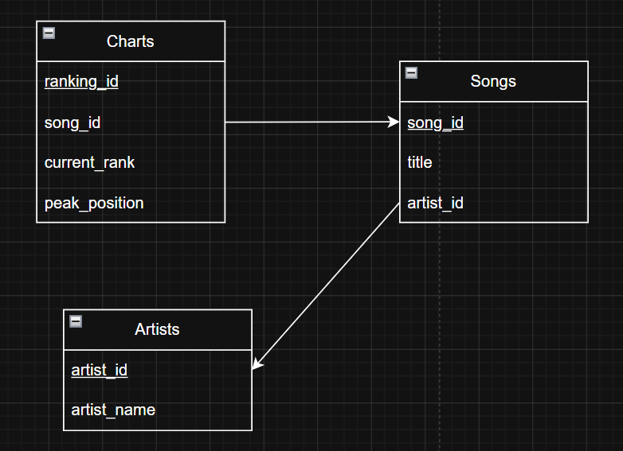
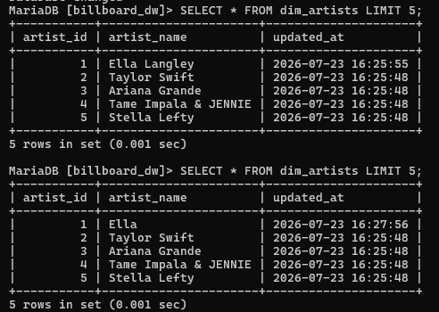

# Seleksi Tahap 2 Asisten Basis Data 2026
ETL Project
Data Scraping, Database Modeling, and Data Storing


## Author
Nama: Reysha Syafitri MR
NIM: 13524137

## Deskripsi singkat mengenai Data dan DBMS yang dipilih
Data diekstrak dari web Billboard karena penggunaan istilah atau kosa kata yang familiar, contohnya Artists, Songs, dan Charts. Penggunaan istilah dan hubungan antar entitas yang familiar dapat mempermudah dalam pembuatan desain untuk Data Storing dan Data Warehouse. Data dari web Billboard Top 100 ini sendiri berisi peringkat-peringkat lagu dan artis top 100 menurut Billboard. DBMS yang dibuat, menggunakan script python untuk scraping, stroing dan warehouse. Uji coba dilakukan dengan MariaDB (bisa dilihat pada folder screenshots untuk pembutikan implementasi DBMS). Pada data warehouse, desain yang digunakan adalah Star Schema, agar mempermudah memdapatkan informasi (misalnya, untuk mengetahui performa lagu dari artis terntentu, hanya butuh sekali JOIN).

## Cara menggunakan scraper yang dibuat dan hasil outputnya
Scraper digunakan dengan library python yakni, requests, BeautifulSoup, dan FeatureNotFound. Hasil ekstraksi dari scraper kemudian disimpan di folder Data Scraping/data untuk kemudian digunakan oleh insert_to_dw.py dan insert_to_db.py untuk datanya dimasukkan ke database. Scraper juga digunakan di Data Warehouse/src/scheduler.py untuk uji coba perbedaan data dengan hasil scraping sebagai data batch pertama. 

```bash
scraping_dir = os.path.join("..", "..", "Data Scraping", "src")
subprocess.run(["python","scraper.py"], cwd=scraping_dir)
```
## Penjelasan struktur dari file JSON yang dihasilkan scraper
file JSON dibagi menjadi artists.json, chart_rankings.json, dan songs.json untuk membedakan jenis data berdasarkan konteks. Struktur JSON dituliskan dengan atribut-atribut yang sudah didefinisikan pada scraper.py bagian relasional mapping

## Struktur ERD dan diagram relasional RDBMS
Berikut adalah diagram ER


Di bawah adalah diagram relasional



## Penjelasan proses Translasi ERD menjadi diagram relasional
diagram relasional dibuat dengan setiap entitas (Artists, Songs, Charts) jadi tabel sendiri. Relasi "membuat" diterjemahkan dengan menaruh FK artist_id dari entitas Artists ke entitas Songs tanpa perlu tabel relasi baru. Relasi memiliki juga diterjemahkan dengan menaruh FK song_id dari Songs ke Charts.

## Screenshot program
Berikut adalah screenshot dari table database biasa


Dan di bawah ini table dari data warehouse


## Referensi
a. halaman web: https://www.billboard.com/charts/hot-100/

b. library: requests, json, BeautifulSoup, FeatureNotFound, mysql.connector  

c. https://www.geeksforgeeks.org/dbms/star-schema-in-data-warehouse-modeling/

## Penggunaan AI
a. Bagian-bagian yang dibantu AI: 
   1. installasi library-library python
   2. script AWAL Data Scraping, Data Storing, Data Warehouse, dan Query Optimasi

b. Bagian-bagian yang tetap dikerjakan sendiri:
   1. prompting script yang disesuaikan dengan objektif tugas
   2. penyesuaian manual pada script (menghapus variabel yang tidak perlu dan mengarahkan penyimpanan suatu file sesuai dengan struktur folder di github, menyesuaikan pembagian jenis-jenis file JSON, dsb)
   2. pembuatan readme.md
   3. pembuatan design Data Storing dan Data Warehouse serta diagram relational model

c. Refleksi dari penggunaan AI:
   1. Gunakan Gemini chat untuk diskusi tetapi jangan langsung copy paste karena beberapa saran/aplikasi dari Gemini tidak selaras dengan objektif tugas.

## Penjelasan automated scheduling
Proses scheduling dilakukan dengan script python (Data Warehouse/src/scheduler.py) proses ini dilakukan dengan meng-ekstraksi batch pertama dan batch kedua (2 menit dari batch pertama). Data pada DBMS dipastikan tidak redundan dengan menggunakan ON DUPLICATE KEY UPDATE saat insert data yang tertera pada file insert_to_dw.py sehingga data yang baru akan menggantikan data yang lama. Untuk mencatat waktu berubahnya data maka ditambahkan "updated_at TIMESTAMP DEFAULT CURRENT_TIMESTAMP ON UPDATE CURRENT_TIMESTAMP" saat create table (bisa dilihat di setup_dw.py). bukti perbedaan waktu ekstraksi data dapat dilihat di bawah (perubahan nama dari Ella Langley ke Ella).


